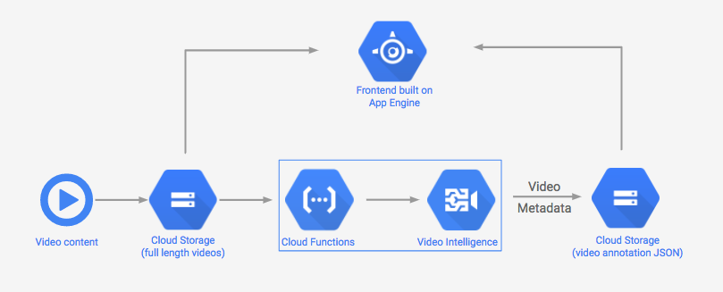

**This is not an official Google product.**

# Video Intelligence API Demo

This is the code for the [Video Intelligence API](https://cloud.google.com/video-intelligence/) demo presented at Google Cloud Next 2017. See a video of the presentation [here](https://www.youtube.com/watch?v=mDAoLO4G4CQ). **Big thank you** to [Alex Wolfe](https://github.com/alexwolfe) for his contributions to this app.

The code for the app is split into frontend and backend repos. Here's what it looks like:

### FRONTEND
- **Frontend**: App Engine app that displays videos and their Video API annotations, and lets you search videos by annotation

#### TECH STACK
- [App Engine](https://cloud.google.com/appengine/docs/flexible/nodejs/)
- [jQuery](http://api.jquery.com/on/)
- [ES6](http://es6-features.org/)
- [Sass](http://sass-lang.com/)
- [Local Storage](https://www.npmjs.com/package/store)
- [lodash](https://lodash.com/docs/4.17.4#trim)
- [Navigo (Routing)](https://github.com/krasimir/navigo)
- [Canavsjs](http://canvasjs.com/docs/charts/basics-of-creating-html5-chart/event-handling/)
- [Webpack - JS Compilation](https://webpack.github.io/)
- [Gulp - Build Process](http://gulpjs.com/)

### BACKEND
- Google Cloud Function that calls the Video API everytime a new video is added to a bucket
- It stores the JSON response output a separate GCS bucket.

#### TECH STACK
- [Cloud Video Intelligence API](https://cloud.google.com/video-intelligence/)
- [Cloud Functions](https://cloud.google.com/functions/)
- [Cloud Storage](https://cloud.google.com/storage/)

## RUNNING THE APP

### Prerequisites

* Install the [gcloud CLI](https://cloud.google.com/sdk/gcloud/)

### Setting up the local development copy of frontend

1. Clone this repo
1. `cd` into the `frontend` directory.
1. Run `npm install` to install dependencies.
1. Run `npm start` in one tab on your terminal
1. Create a new tab and `gulp dev` init.
1. Make sure `npm start` and `gulp` are running at the same time.
1. Navigate to `localhost:8080`. You should see the UI without any videos - that part is next!
1. (Optional step) If you want to see the UI with some sample video content before deploying your function and adding your own videos, copy the `google-home-superbowl.mp4` file in the root directory to your video storage bucket and copy the `google-home-superbowlmp4.json` file to your video JSON annotation storage bucket. Run the frontend and you'll see the video with the annotations visualized.

### Setting up the backend (Cloud Functions + Video Intelligence API)

#### Setup Project

1. Create a Cloud project
1. Enable the Video Intelligence API (requires being part of the private beta)
1. Enable Cloud Functions.
1. Generate an API key and a JSON keyfile.

#### Setup Storage

1. In your project, create three Cloud Storage buckets:
    * one for your videos
    * one for the video JSON output
    * one as a staging bucket for your Cloud Function.
1. Set permissions for your Storage Buckets
    * Make video bucket world readable - Group - allUsers - Reader
    * Make JSON annotation bucket writable by service account - User - [serviceaccount] - Owner

#### Setup Credentials
1. Make copy of `frontend/local.sample.json` named `frontend/local.json`
1. Make copy of `backend/local.sample.json` named `backend/local.json`.
1. Copy your Cloud project ID, storage bucket names, and API key into `frontend/local.json` and `backend/local.json`.
1. Copy your generated service account json file into a file called `keyfile.json` and place a copy in both your frontend AND backend directories (you'll deploy these separately, one to App Engine and one to Cloud Functions).

#### Deploy
1. `cd` into `backend`.
1. run `gcloud config set project your-project-id`.
1. Deploy the Cloud Function:
`gcloud beta functions deploy analyzeVideo --stage-bucket your-stage-bucket-name --trigger-bucket your-video-bucket`
1. With your function deployed, try uploading a video to your video storage bucket. When the Video API finishes processing it, you should see the annotation JSON file in your annotation bucket. If the JSON annotations aren't there, check your Functions logs for errors in the Logging tab of your Cloud console.
1. To see the video in your UI: navigate to localhost:8080/profile, then click 'clear local storage' and 'get videos'.

### Deploy the frontend
1. `cd` into `frontend`.
1. run `gcloud config set project your-project-id`.
1. Deploy your app with `gcloud app deploy`.

